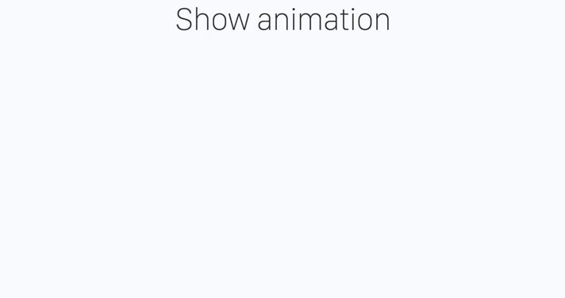

# WebSlidesAnimation: Animation without page transition

[](http://opensource.org/licenses/MIT)
[](https://github.com/iwamatsu0430/WebSlidesAnimation/releases/latest)
[](https://badge.fury.io/js/webslides-animation)

This is Plug-in for WebSlides. This plug-in adds slide animation without page transition.



[DEMO Slide](https://iwamatsu0430.github.io/WebSlidesAnimation/example/)

# Download

[v1.0.0](https://github.com/iwamatsu0430/WebSlidesAnimation/releases/download/1.0.0/webslides-animation.js)

# Usage

Add script after webslides.js and call `addWebSlideAnimation`

```
<script src="./webslides.js"></script>
<script src="./webslides-animation.js"></script>
<script>
  window.ws = new WebSlides();
  addWebSlideAnimation(window.ws);
</script>
```

# Credit

- WebSlidesAnimation was created by [@iwamatsu0430](https://github.com/iwamatsu0430).
- WebSlides was created by [@jlantunez](https://twitter.com/jlantunez) using [Cactus](https://github.com/eudicots/Cactus).
